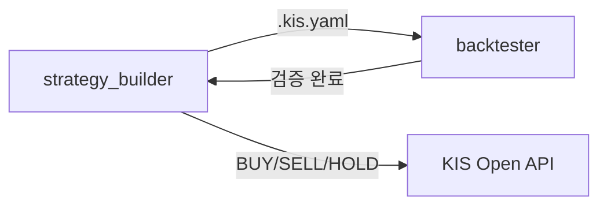

# 한국투자증권 Open Trading API — 국내주식 모의투자 가이드

한국투자증권(Korea Investment & Securities) Open Trading API를 활용한 **국내주식 모의투자(Paper Trading)** Postman 컬렉션 사용 가이드입니다.  
이 컬렉션(`모의투자(모의Env)`)은 실제 자금 없이 모의 환경에서 국내 주식 시세 조회 및 주문/계좌 관련 API를 테스트할 수 있도록 구성되어 있습니다.

> **참고:** 모의투자 환경은 실전 투자와 별도의 앱키(AppKey) 및 토큰이 필요합니다. 반드시 모의투자 전용 자격증명을 사용하세요.

---

## 목차

1. [사전 준비 (Prerequisites)](#사전-준비-prerequisites)
2. [인증 (Authentication)](#인증-authentication)
3. [[국내주식] 기본시세](#국내주식-기본시세)
4. [[국내주식] 주문/계좌](#국내주식-주문계좌)
5. [공통 요청 헤더](#공통-요청-헤더)
6. [오류 코드 참고](#오류-코드-참고)

---

## 사전 준비 (Prerequisites)

### 1. 한국투자증권 Open API 신청

[한국투자증권 Open API 포털](https://apiportal.koreainvestment.com)에서 모의투자 앱키를 발급받으세요.

### 2. Postman 환경 변수 설정

컬렉션 실행 전, `모의Env` 환경에서 아래 변수들을 반드시 설정해야 합니다.

| 변수명 | 설명 | 예시 |
|---|---|---|
| `VTS` | 모의투자 API Base URL | `https://openapivts.koreainvestment.com:29443` |
| `VTS_APPKEY` | 모의투자 앱키 (App Key) | `PSxxxxxxxxxxxxxxxxxxxxxxxx` |
| `VTS_APPSECRET` | 모의투자 앱 시크릿 (App Secret) | `xxxxxxxx...` |
| `VTS_TOKEN` | OAuth 액세스 토큰 (자동 발급 또는 수동 입력) | `Bearer eyJ0...` |
| `VTS_HASH` | HashKey (POST 요청 시 필요) | `xxxxxxxx...` |
| `CANO` | 모의투자 계좌번호 앞 8자리 | `50123456` |
| `CANO_T` | 계좌 상품 코드 (Account Product Code) | `01` |

> **보안 주의:** `VTS_APPSECRET` 및 `VTS_TOKEN`은 Postman의 **Secret** 타입 변수로 저장하여 노출을 방지하세요.

---

## 인증 (Authentication)

국내주식 API를 호출하기 전에 **반드시 OAuth 토큰을 먼저 발급**받아야 합니다.

### 토큰 발급 순서

1. 컬렉션 내 **[OAuth]** 폴더의 토큰 발급 요청을 먼저 실행합니다.
2. 발급된 `access_token` 값이 `VTS_TOKEN` 환경 변수에 자동으로 저장됩니다.
3. 이후 모든 국내주식 API 요청에서 해당 토큰이 자동으로 사용됩니다.

```
POST {{VTS}}/oauth2/tokenP
Content-Type: application/json

{
  "grant_type": "client_credentials",
  "appkey": "{{VTS_APPKEY}}",
  "appsecret": "{{VTS_APPSECRET}}"
}
```

> 토큰 유효 기간은 **24시간**입니다. 만료 시 재발급이 필요합니다.

### HashKey 발급 (POST 요청 시 필요)

주문 API 등 POST 요청을 사용할 때는 `VTS_HASH` 값도 필요합니다.  
**[OAuth]** 폴더의 HashKey 발급 요청을 실행하여 `VTS_HASH`를 설정하세요.

---

## [국내주식] 기본시세

주식 현재가, 체결 내역, 호가, 투자자 동향 등 다양한 시세 데이터를 조회하는 API 모음입니다.  
모든 요청은 `GET` 방식이며, `{{VTS}}`를 Base URL로 사용합니다.

### 공통 Query Parameter

| 파라미터 | 설명 | 예시 |
|---|---|---|
| `fid_cond_mrkt_div_code` | 시장 구분 코드 | `J` (주식), `U` (업종), `W` (ELW) |
| `fid_input_iscd` | 종목 코드 | `005930` (삼성전자) |

---

### API 목록

| # | 요청 이름 | Method | Endpoint | 설명 |
|---|---|---|---|---|
| 1 | V_주식현재가 시세 | `GET` | `/uapi/domestic-stock/v1/quotations/inquire-price` | 특정 종목의 현재가 시세 조회 |
| 2 | V_주식현재가 체결(최근30건) | `GET` | `/uapi/domestic-stock/v1/quotations/inquire-ccnl` | 최근 30건 체결 내역 조회 |
| 3 | V_주식현재가 일자별 | `GET` | `/uapi/domestic-stock/v1/quotations/inquire-daily-price` | 일자별 주가 조회 |
| 4 | V_주식현재가 호가 예상체결 | `GET` | `/uapi/domestic-stock/v1/quotations/inquire-asking-price-exp-ccn` | 호가 및 예상 체결가 조회 |
| 5 | V_주식현재가 투자자 | `GET` | `/uapi/domestic-stock/v1/quotations/inquire-investor` | 투자자별 매매동향 조회 |
| 6 | V_주식현재가 회원사 | `GET` | `/uapi/domestic-stock/v1/quotations/inquire-member` | 회원사별 매매동향 조회 |
| 7 | V_주식현재가 당일시간대별체결 | `GET` | `/uapi/domestic-stock/v1/quotations/inquire-time-itemconclusion` | 당일 시간대별 체결 조회 |
| 8 | V_국내주식기간별시세(일/주/월/년) | `GET` | `/uapi/domestic-stock/v1/quotations/inquire-daily-itemchartprice` | 기간별 시세 (일/주/월/년) 조회 |
| 9 | V_주식현재가 시간외 일자별주가 | `GET` | `/uapi/domestic-stock/v1/quotations/inquire-daily-overtimeprice` | 시간외 일자별 주가 조회 |
| 10 | V_주식현재가 시간외 시간별체결 | `GET` | `/uapi/domestic-stock/v1/quotations/inquire-time-overtimeconclusion` | 시간외 시간별 체결 조회 |
| 11 | V_국내주식업종기간별시세(일/주/월/년) | `GET` | `/uapi/domestic-stock/v1/quotations/inquire-daily-indexchartprice` | 업종 기간별 시세 조회 |
| 12 | V_주식당일분봉조회 | `GET` | `/uapi/domestic-stock/v1/quotations/inquire-time-itemchartprice` | 당일 분봉(Minute Candle) 데이터 조회 |
| 13 | V_주식현재가 ELW현재가 시세 | `GET` | `/uapi/domestic-stock/v1/quotations/inquire-elw-price` | ELW 현재가 시세 조회 |

---

### 상세 설명

#### 1. V_주식현재가 시세
```
GET {{VTS}}/uapi/domestic-stock/v1/quotations/inquire-price
```
특정 종목의 현재가 및 등락률, 거래량 등 기본 시세 정보를 조회합니다.

**주요 Query Parameters:**
| 파라미터 | 값 | 설명 |
|---|---|---|
| `fid_cond_mrkt_div_code` | `J` | 주식 시장 구분 |
| `fid_input_iscd` | `005930` | 종목 코드 (예: 삼성전자) |

---

#### 2. V_주식현재가 체결(최근30건)
```
GET {{VTS}}/uapi/domestic-stock/v1/quotations/inquire-ccnl
```
해당 종목의 최근 30건 체결 내역(체결 시간, 체결가, 체결량)을 조회합니다.

---

#### 3. V_주식현재가 일자별
```
GET {{VTS}}/uapi/domestic-stock/v1/quotations/inquire-daily-price
```
일자별 주가(시가, 고가, 저가, 종가, 거래량)를 조회합니다.

**주요 Query Parameters:**
| 파라미터 | 값 | 설명 |
|---|---|---|
| `fid_period_div_code` | `D` | 기간 구분 (D: 일, W: 주, M: 월) |
| `fid_org_adj_prc` | `1` | 수정주가 여부 (0: 수정주가, 1: 원주가) |

---

#### 4. V_주식현재가 호가 예상체결
```
GET {{VTS}}/uapi/domestic-stock/v1/quotations/inquire-asking-price-exp-ccn
```
매수/매도 호가 10단계 및 예상 체결가를 조회합니다.

---

#### 5. V_주식현재가 투자자
```
GET {{VTS}}/uapi/domestic-stock/v1/quotations/inquire-investor
```
개인, 외국인, 기관 등 투자자 유형별 매매동향을 조회합니다.

---

#### 6. V_주식현재가 회원사
```
GET {{VTS}}/uapi/domestic-stock/v1/quotations/inquire-member
```
증권사(회원사)별 매수/매도 동향을 조회합니다.

---

#### 7. V_주식현재가 당일시간대별체결
```
GET {{VTS}}/uapi/domestic-stock/v1/quotations/inquire-time-itemconclusion
```
당일 특정 시간 이후의 시간대별 체결 데이터를 조회합니다.

**주요 Query Parameters:**
| 파라미터 | 값 | 설명 |
|---|---|---|
| `fid_input_hour_1` | `155000` | 조회 시작 시간 (HHMMSS 형식, 예: 오후 3시 50분) |

---

#### 8. V_국내주식기간별시세(일/주/월/년)
```
GET {{VTS}}/uapi/domestic-stock/v1/quotations/inquire-daily-itemchartprice
```
지정한 기간 동안의 일/주/월/년 단위 시세 데이터를 조회합니다. 차트 데이터 구성에 활용할 수 있습니다.

**주요 Query Parameters:**
| 파라미터 | 값 | 설명 |
|---|---|---|
| `fid_input_date_1` | `20240101` | 조회 시작일 (YYYYMMDD) |
| `fid_input_date_2` | `20241231` | 조회 종료일 (YYYYMMDD) |
| `fid_period_div_code` | `D` | 기간 구분 (D: 일, W: 주, M: 월, Y: 년) |

---

#### 9. V_주식현재가 시간외 일자별주가
```
GET {{VTS}}/uapi/domestic-stock/v1/quotations/inquire-daily-overtimeprice
```
시간외 거래(장 전/후)의 일자별 주가를 조회합니다.

---

#### 10. V_주식현재가 시간외 시간별체결
```
GET {{VTS}}/uapi/domestic-stock/v1/quotations/inquire-time-overtimeconclusion
```
시간외 거래의 시간별 체결 내역을 조회합니다.

---

#### 11. V_국내주식업종기간별시세(일/주/월/년)
```
GET {{VTS}}/uapi/domestic-stock/v1/quotations/inquire-daily-indexchartprice
```
KOSPI, KOSDAQ 등 업종 지수의 기간별 시세를 조회합니다.

**주요 Query Parameters:**
| 파라미터 | 값 | 설명 |
|---|---|---|
| `fid_cond_mrkt_div_code` | `U` | 업종 시장 구분 |
| `fid_input_iscd` | `0001` | 업종 코드 (0001: KOSPI, 1001: KOSDAQ) |

---

#### 12. V_주식당일분봉조회
```
GET {{VTS}}/uapi/domestic-stock/v1/quotations/inquire-time-itemchartprice
```
당일 분봉(Minute Candle) 데이터를 조회합니다. 단기 차트 분석에 활용할 수 있습니다.

---

#### 13. V_주식현재가 ELW현재가 시세
```
GET {{VTS}}/uapi/domestic-stock/v1/quotations/inquire-elw-price
```
ELW(Equity Linked Warrant) 종목의 현재가 시세를 조회합니다.

**주요 Query Parameters:**
| 파라미터 | 값 | 설명 |
|---|---|---|
| `fid_cond_mrkt_div_code` | `W` | ELW 시장 구분 |

---

## [국내주식] 주문/계좌

주식 주문 제출, 정정/취소, 잔고 및 체결 내역 조회 등 계좌 관련 API 모음입니다.  
**POST 요청**은 `VTS_HASH` 값이 필요하며, 모든 요청에 `VTS_TOKEN` 인증이 필요합니다.

### API 목록

| # | 요청 이름 | Method | Endpoint | 설명 |
|---|---|---|---|---|
| 1 | V_주식주문(현금) | `POST` | `/uapi/domestic-stock/v1/trading/order-cash` | 현금 주식 매수/매도 주문 |
| 2 | V_주식주문(정정취소) | `POST` | `/uapi/domestic-stock/v1/trading/order-rvsecncl` | 기존 주문 정정 또는 취소 |
| 3 | V_매수가능조회 | `GET` | `/uapi/domestic-stock/v1/trading/inquire-psbl-order` | 매수 가능 금액 조회 |
| 4 | V_주식잔고조회 | `GET` | `/uapi/domestic-stock/v1/trading/inquire-balance` | 주식 잔고 조회 |
| 5 | V_주식일별주문체결조회 | `GET` | `/uapi/domestic-stock/v1/trading/inquire-daily-ccld` | 일별 주문 체결 내역 조회 |

---

### 상세 설명

#### 1. V_주식주문(현금)
```
POST {{VTS}}/uapi/domestic-stock/v1/trading/order-cash
```
현금으로 주식을 매수하거나 매도하는 주문을 제출합니다.

**Request Body 예시 (매수):**
```json
{
  "CANO": "{{CANO}}",
  "ACNT_PRDT_CD": "{{CANO_T}}",
  "PDNO": "005930",
  "ORD_DVSN": "00",
  "ORD_QTY": "10",
  "ORD_UNPR": "75000"
}
```

| 필드 | 설명 | 예시 |
|---|---|---|
| `CANO` | 계좌번호 앞 8자리 | `{{CANO}}` |
| `ACNT_PRDT_CD` | 계좌 상품 코드 | `{{CANO_T}}` |
| `PDNO` | 종목 코드 | `005930` |
| `ORD_DVSN` | 주문 구분 (00: 지정가, 01: 시장가) | `00` |
| `ORD_QTY` | 주문 수량 | `10` |
| `ORD_UNPR` | 주문 단가 (시장가 주문 시 `0`) | `75000` |

> **tr_id 헤더:** 매수 시 `VTTC0802U`, 매도 시 `VTTC0801U`를 사용합니다.

---

#### 2. V_주식주문(정정취소)
```
POST {{VTS}}/uapi/domestic-stock/v1/trading/order-rvsecncl
```
이미 제출된 주문을 정정하거나 취소합니다.

**Request Body 예시 (취소):**
```json
{
  "CANO": "{{CANO}}",
  "ACNT_PRDT_CD": "{{CANO_T}}",
  "KRX_FWDG_ORD_ORGNO": "",
  "ORGN_ODNO": "0000123456",
  "ORD_DVSN": "00",
  "RVSE_CNCL_DVSN_CD": "02",
  "ORD_QTY": "0",
  "ORD_UNPR": "0",
  "QTY_ALL_ORD_YN": "Y"
}
```

| 필드 | 설명 | 예시 |
|---|---|---|
| `ORGN_ODNO` | 원주문 번호 | `0000123456` |
| `RVSE_CNCL_DVSN_CD` | 정정/취소 구분 (01: 정정, 02: 취소) | `02` |
| `QTY_ALL_ORD_YN` | 전량 주문 여부 | `Y` |

> **tr_id 헤더:** `VTTC0803U`를 사용합니다.

---

#### 3. V_매수가능조회
```
GET {{VTS}}/uapi/domestic-stock/v1/trading/inquire-psbl-order
```
특정 종목을 특정 가격에 매수할 수 있는 최대 수량 및 가능 금액을 조회합니다.

**주요 Query Parameters:**
| 파라미터 | 값 | 설명 |
|---|---|---|
| `CANO` | `{{CANO}}` | 계좌번호 앞 8자리 |
| `ACNT_PRDT_CD` | `{{CANO_T}}` | 계좌 상품 코드 |
| `PDNO` | `005930` | 종목 코드 |
| `ORD_UNPR` | `55000` | 주문 단가 |
| `ORD_DVSN` | `00` | 주문 구분 |
| `CMA_EVLU_AMT_ICLD_YN` | `Y` | CMA 평가금액 포함 여부 |
| `OVRS_ICLD_YN` | `N` | 해외 포함 여부 |

---

#### 4. V_주식잔고조회
```
GET {{VTS}}/uapi/domestic-stock/v1/trading/inquire-balance
```
현재 보유 중인 주식 잔고 및 평가 손익을 조회합니다.

**주요 Query Parameters:**
| 파라미터 | 값 | 설명 |
|---|---|---|
| `CANO` | `{{CANO}}` | 계좌번호 앞 8자리 |
| `ACNT_PRDT_CD` | `{{CANO_T}}` | 계좌 상품 코드 |
| `AFHR_FLPR_YN` | `N` | 시간외 단일가 여부 |
| `INQR_DVSN` | `02` | 조회 구분 |
| `UNPR_DVSN` | `01` | 단가 구분 |
| `FUND_STTL_ICLD_YN` | `N` | 펀드 결제 포함 여부 |
| `FNCG_AMT_AUTO_RDPT_YN` | `N` | 융자금액 자동 상환 여부 |
| `PRCS_DVSN` | `00` | 처리 구분 |

---

#### 5. V_주식일별주문체결조회
```
GET {{VTS}}/uapi/domestic-stock/v1/trading/inquire-daily-ccld
```
지정한 기간 동안의 일별 주문 체결 내역을 조회합니다.

**주요 Query Parameters:**
| 파라미터 | 값 | 설명 |
|---|---|---|
| `CANO` | `{{CANO}}` | 계좌번호 앞 8자리 |
| `ACNT_PRDT_CD` | `{{CANO_T}}` | 계좌 상품 코드 |
| `INQR_STRT_DT` | `20240101` | 조회 시작일 (YYYYMMDD) |
| `INQR_END_DT` | `20241231` | 조회 종료일 (YYYYMMDD) |
| `SLL_BUY_DVSN_CD` | `00` | 매도/매수 구분 (00: 전체, 01: 매도, 02: 매수) |
| `INQR_DVSN` | `00` | 조회 구분 |
| `PDNO` | _(선택)_ | 특정 종목 코드 필터 |
| `CTX_AREA_FK100` | _(페이징)_ | 연속 조회 키 |
| `CTX_AREA_NK100` | _(페이징)_ | 연속 조회 키 |

---

## 공통 요청 헤더

모든 API 요청에 아래 헤더가 필요합니다.

```
Content-Type: application/json; charset=utf-8
authorization: Bearer {{VTS_TOKEN}}
appkey: {{VTS_APPKEY}}
appsecret: {{VTS_APPSECRET}}
tr_id: <각 API별 tr_id>
custtype: P
```

| 헤더 | 설명 |
|---|---|
| `authorization` | `Bearer {{VTS_TOKEN}}` 형식의 OAuth 토큰 |
| `appkey` | 모의투자 앱키 |
| `appsecret` | 모의투자 앱 시크릿 |
| `tr_id` | 거래 ID (각 API 문서 참조) |
| `custtype` | 고객 유형 (`P`: 개인, `B`: 법인) |

> POST 요청의 경우 `hashkey: {{VTS_HASH}}` 헤더도 추가해야 합니다.

---

## 오류 코드 참고

| HTTP 상태 코드 | 설명 | 조치 방법 |
|---|---|---|
| `200` | 성공 | — |
| `400` | 잘못된 요청 (파라미터 오류) | 요청 파라미터 확인 |
| `401` | 인증 실패 | `VTS_TOKEN` 재발급 |
| `403` | 권한 없음 | 앱키 및 계좌 권한 확인 |
| `500` | 서버 오류 | 잠시 후 재시도 |

응답 본문의 `rt_cd` 필드가 `"0"`이면 성공, 그 외는 `msg_cd` 및 `msg1` 필드를 통해 오류 내용을 확인하세요.

```json
{
  "rt_cd": "0",
  "msg_cd": "MAPIKEY0000",
  "msg1": "정상처리 되었습니다."
}
```

---

## 참고 링크

- [한국투자증권 Open API 포털](https://apiportal.koreainvestment.com)
- [API 공식 문서](https://apiportal.koreainvestment.com/apiservice)
- [모의투자 안내](https://apiportal.koreainvestment.com/intro)

---

> 이 README는 `모의투자(모의Env)` Postman 컬렉션을 기반으로 작성되었습니다.  
> 실전 투자 환경에서는 `실전투자(실전Env)` 컬렉션과 `실전Env` 환경을 사용하세요.

**[당사에서 제공하는 샘플코드에 대한 유의사항]**

- 샘플 코드는 한국투자증권 Open API(KIS Developers)를 연동하는 예시입니다. 고객님의 개발 부담을 줄이고자 참고용으로 제공되고 있습니다.
- 샘플 코드는 별도의 공지 없이 지속적으로 업데이트될 수 있습니다.
- 샘플 코드를 활용하여 제작한 고객님의 프로그램으로 인한 손해에 대해서는 당사에서 책임지지 않습니다.

# KIS Open API 샘플 코드 저장소 (LLM 지원)

## 1. 제작 의도 및 대상

### 🎯 제작 의도

이 저장소는 **ChatGPT, Claude 등 LLM(Large Language Model)** 기반 자동화 환경과 Python 개발자 모두가
**한국투자증권(Korea Investment & Securities) Open API를 쉽게 이해하고 활용**할 수 있도록 구성된 샘플 코드 모음입니다.

- `examples_llm/`: LLM이 단일 API 기능을 쉽게 탐색하고 호출할 수 있도록 구성된 기능 단위 샘플 코드
- `examples_user/`: 사용자가 실제 투자 및 자동매매 구현에 활용할 수 있도록 상품별로 통합된 API 호출 예제 코드
- `strategy_builder/`: 비주얼 UI로 매매 전략을 설계하고, 생성된 시그널 바탕으로 매수/매도 가능
- `backtester/`: 설계한 전략을 과거 데이터로 검증하는 백테스팅 엔진

> AI와 사람이 모두 활용하기 쉬운 구조를 지향합니다.

[한국투자증권 Open API 포털 바로가기](https://apiportal.koreainvestment.com/)

### 👤 대상 사용자

- 한국투자증권 Open API를 처음 사용하는 Python 개발자
- 기존 Open API 사용자 중 코드 개선 및 구조 학습이 필요한 사용자
- LLM 기반 코드 에이전트를 활용해 종목 검색, 시세 분석, 자동매매 등을 구현하고자 하는 사용자

## 2. 폴더 구조 및 주요 파일 설명

### 2.1. 폴더 구조

```
# 프로젝트 구조
.
├── README.md                    # 프로젝트 설명서
├── strategy_builder/            # 전략 설계 + 시그널 생성 엔진           ← New
├── backtester/                  # 백테스팅 엔진 (QuantConnect Lean)   ← New
│
├── docs/
│   └── convention.md            # 코딩 컨벤션 가이드
├── examples_llm/                  # LLM용 샘플 코드
│   ├── kis_auth.py              # 인증 공통 함수
│   ├── auth                     # 인증(토큰 발급)
│   │   ├── auth_token               # REST 접근토큰 발급
│   │   └── auth_ws_token            # 웹소켓 접속키 발급
│   ├── domestic_bond            # 국내채권
│   │   └── inquire_price        # API 단일 기능별 폴더
│   │       ├── inquire_price.py         # 한줄 호출 파일 (예: 채권 가격 조회)
│   │       └── chk_inquire_price.py     # 테스트 파일 (예: 채권 가격 조회 결과 검증)
│   ├── domestic_futureoption    # 국내선물옵션
│   ├── domestic_stock           # 국내주식
│   ├── elw                      # ELW
│   ├── etfetn                   # ETF/ETN
│   ├── overseas_futureoption    # 해외선물옵션
│   └── overseas_stock           # 해외주식
├── examples_user/                 # user용 실제 사용 예제
│   ├── kis_auth.py              # 인증 공통 함수
│   ├── auth                     # 인증(토큰 발급)
│   │   ├── auth_functions.py            # 인증 함수 모음
│   │   └── auth_examples.py             # 인증 실행 예제
│   ├── domestic_bond            # 국내채권
│   │   ├── domestic_bond_functions.py        # (REST) 통합 함수 파일 (모든 API 함수 모음)
│   │   ├── domestic_bond_examples.py         # (REST) 실행 예제 파일 (함수 사용법)
│   │   ├── domestic_bond_functions_ws.py     # (Websocket) 통합 함수 파일
│   │   └── domestic_bond_examples_ws.py      # (Websocket) 실행 예제 파일
│   ├── domestic_futureoption    # 국내선물옵션
│   ├── domestic_stock           # 국내주식
│   ├── elw                      # ELW
│   ├── etfetn                   # ETF/ETN
│   ├── overseas_futureoption    # 해외선물옵션
│   └── overseas_stock           # 해외주식
├── legacy/                      # 구 샘플코드 보관
├── stocks_info/                 # 종목정보파일 참고 데이터
├── kis_devlp.yaml               # API 설정 파일 (개인정보 입력 필요)
├── pyproject.toml               # (uv)프로젝트 의존성 관리
└── uv.lock                      # (uv)의존성 락 파일
```

### 2.2. 지원되는 주요 API 카테고리

- 아래 카테고리 및 폴더 구조는 examples_llm/, examples_user/ 폴더 모두 동일하게 적용됩니다.

| 카테고리 | 설명 | 폴더명 |
| --- | --- | --- |
| 인증 | 접근토큰 발급, 웹소켓 접속키 발급 | `auth` |
| 국내주식 | 국내 주식 시세, 주문, 잔고 등 | `domestic_stock` |
| 국내채권 | 국내 채권 시세, 주문 등 | `domestic_bond` |
| 국내선물옵션 | 국내 파생상품 관련 | `domestic_futureoption` |
| 해외주식 | 해외 주식 시세, 주문 등 | `overseas_stock` |
| 해외선물옵션 | 해외 파생상품 관련 | `overseas_futureoption` |
| ELW | ELW 시세 API | `elw` |
| ETF/ETN | ETF, ETN 시세 API | `etfetn` |

### 2.3. 주요 파일 설명

### `examples_llm/` - llm용 기능 단위 샘플 코드

**API별 개별 폴더 구조**: 단일 API 기능을 독립 폴더로 분리하여, LLM이 관련 코드를 쉽게 탐색할 수 있도록 구성
- **한줄 호출 파일**: `[함수명].py` – 단일 기능을 호출하는 최소 단위 코드 (예: `inquire_price.py`)
- **테스트 파일**: `chk_[함수명].py` – 호출 결과를 검증하는 테스트 실행 코드 (예: `chk_inquire_price.py`)

### `examples_user/` - 사용자용 통합 예제 코드

**카테고리별 개별 폴더 구조**: 카테고리(상품)별로 모든 기능을 통합하여, 사용자가 쉽게 샘플 코드를 탐색하고 실행할 수 있도록 구성
- **통합 함수 파일**: `[카테고리]_functions.py` - 해당 카테고리의 모든 API 기능이 통합된 함수 모음
- **실행 예제 파일**: `[카테고리]_examples.py` - 실제 사용 예제를 기반으로 한 실행 코드
- **웹소켓 통합 함수 파일 및 실행 예제 파일**: `[카테고리]_functions_ws.py`, `[카테고리]_examples_ws.py`

### `kis_auth.py` - 인증 및 공통 기능

- 접근토큰 발급 및 관리
- API 호출 공통 함수
- 실전투자/모의투자 환경 전환 지원
- 웹소켓 연결 설정 기능 제공

### 2.4. AI 트레이딩 도구

샘플 코드 외에, Open API를 활용한 **전략 설계 → 백테스팅 → 주문 실행** 파이프라인을 제공합니다.



| 디렉토리 | 역할 | 상세 |
|----------|------|------|
| `strategy_builder/` | 전략 설계 + 시그널 생성 | 80개 기술지표, 10개 프리셋 전략, BUY/SELL/HOLD 신호 ([README](strategy_builder/README.md)) |
| `backtester/` | 과거 검증 + 파라미터 최적화 | Docker 기반 QuantConnect Lean, HTML 리포트 ([README](backtester/README.md)) |
| `MCP/` | AI 도구 연결 | KIS Code Assistant + Trading MCP ([README](MCP/README.MD)) |

#### 10개 프리셋 전략

`strategy_builder`와 `backtester` 양쪽에서 동일하게 지원합니다.

| # | 전략명 | 유형 | 한줄 설명 |
|---|--------|------|-----------|
| 01 | 골든크로스 | 추세추종 | 단기 이동평균이 장기 이동평균을 상향 돌파하면 매수 |
| 02 | 모멘텀 | 추세추종 | 최근 N일 수익률이 높은 종목을 매수 |
| 03 | 52주 신고가 | 돌파매매 | 종가가 52주 최고가를 갱신하면 매수 |
| 04 | 연속 상승/하락 | 추세추종 | N일 연속 종가 상승 시 매수, N일 연속 하락 시 매도 |
| 05 | 이격도 | 역추세 | 종가/이동평균 비율로 과열(매도)·침체(매수) 판단 |
| 06 | 돌파 실패 | 손절 | 전고점 돌파 후 다시 아래로 빠지면 손절 |
| 07 | 강한 종가 | 모멘텀 | 종가가 당일 고가 근처에서 마감하면 매수 |
| 08 | 변동성 확장 | 돌파매매 | 변동성이 줄어든 뒤 급등하면 매수 |
| 09 | 평균회귀 | 역추세 | 가격이 평균에서 크게 벗어나면 반대 방향으로 매매 |
| 10 | 추세 필터 | 추세추종 | 장기 이동평균 위에서 상승 중이면 매수 |

#### .kis.yaml — 공유 전략 포맷

`strategy_builder`에서 설계한 전략을 `.kis.yaml`로 내보내면, `backtester`에서 그대로 Import하여 백테스트를 수행할 수 있습니다.
포맷 상세는 [strategy_builder/README.md](strategy_builder/README.md#kisyaml-포맷) 또는 [backtester/README.md](backtester/README.md#kisyaml-포맷)를 참고하세요.

## 3. 사전 환경설정 안내

### 3.1. Python 환경 요구사항

- **Python 3.11 이상** 필요
- **uv** **패키지 매니저 사용** 권장 (빠르고 간편한 의존성 관리)

### 3.2. uv 설치 방법

- 간편 설정을 위해 uv를 권장합니다

```bash
# Windows (PowerShell)
powershell -c "irm https://astral.sh/uv/install.ps1 | iex"

# macOS/Linux
curl -LsSf https://astral.sh/uv/install.sh | sh

# 설치 확인
uv --version
# uv 0.x.x ... -> 설치 완료
```

### 3.3. 프로젝트 클론 및 환경 설정

```bash
# 저장소 클론
git clone https://github.com/koreainvestment/open-trading-api
cd open-trading-api

# uv를 사용한 의존성 설치 - 한줄로 끝
uv sync
```

### 3.4. KIS Open API 신청 및 설정

🍀 [서비스 신청 안내 바로가기](https://apiportal.koreainvestment.com/about-howto)
1. 한국투자증권 **계좌 개설 및 ID 연결**
2. 한국투자증권 홈페이지 or 앱에서 **Open API 서비스 신청**
3. **앱키(App Key)**, **앱시크릿(App Secret)** 발급
4. **모의투자** 및 **실전투자** 앱키 각각 준비

### 3.5. kis_devlp.yaml 설정

- 본인의 계정 설정을 위해 `kis_devlp.yaml` 파일을 수정합니다.
- 기본 경로는 `~/KIS/config/kis_devlp.yaml`입니다. 폴더가 없으면 생성해 주세요.
- 프로젝트 루트의 `kis_devlp.yaml`을 `~/KIS/config/`로 복사한 뒤 수정하는 것을 권장합니다.
- 경로를 변경하고 싶다면 `kis_auth.py`의 `config_root` 값을 수정하면 됩니다.

```bash
# 설정 폴더 생성 및 파일 복사
mkdir -p ~/KIS/config
cp kis_devlp.yaml ~/KIS/config/
```

1. `~/KIS/config/kis_devlp.yaml` 파일 열기
2. **앱키와 앱시크릿** 정보 입력
3. **HTS ID** 정보 입력
4. **계좌번호** 정보 입력 (앞 8자리와 뒤 2자리 구분)
5. **저장** 후 닫기

```yaml
# 실전투자
my_app: "여기에 실전투자 앱키 입력"
my_sec: "여기에 실전투자 앱시크릿 입력"

# 모의투자
paper_app: "여기에 모의투자 앱키 입력"
paper_sec: "여기에 모의투자 앱시크릿 입력"

# HTS ID(KIS Developers 고객 ID) - 체결통보, 나의 조건 목록 확인 등에 사용됩니다.
my_htsid: "사용자 HTS ID"

# 계좌번호 앞 8자리
my_acct_stock: "증권계좌 8자리"
my_acct_future: "선물옵션계좌 8자리"
my_paper_stock: "모의투자 증권계좌 8자리"
my_paper_future: "모의투자 선물옵션계좌 8자리"

# 계좌번호 뒤 2자리
my_prod: "01" # 종합계좌
# my_prod: "03" # 국내선물옵션 계좌
# my_prod: "08" # 해외선물옵션 계좌
# my_prod: "22" # 개인연금 계좌
# my_prod: "29" # 퇴직연금 계좌

# User-Agent(기본값 사용 권장, 변경 불필요)
my_agent: "Mozilla/5.0 (Windows NT 10.0; Win64; x64) AppleWebKit/537.36"
```

### 3.6. 실행파일 내 인증 설정 검토

- 실행하려는 파일에서 인증 관련 설정을 검토 혹은 변경해줍니다. 국내주식 기능 전체를 이용하시려면, `domestic_stock/domestic_stock_examples.py` 파일을 확인해주세요. 
ka.auth() 함수의 svr, product 매개변수를 아래와 같이 수정하면 실전환경(prod)에서 위탁계좌(-01)로 매매 테스트가 가능합니다.

```python
import kis_auth as ka

# 실전투자 인증
ka.auth(svr="prod", product="01") # 모의투자: svr="vps"
```

### 3.7. 전략 빌더 / 백테스터 환경 설정 (선택)

전략 설계 및 백테스팅 기능을 사용하려면 추가 설정이 필요합니다.

| 항목 | 설치 | 용도 |
|------|------|------|
| Node.js 18+ | [nodejs.org](https://nodejs.org/) | strategy_builder, backtester 프론트엔드 |
| Docker Desktop | [docker.com](https://www.docker.com/products/docker-desktop) | backtester (Lean 엔진) |

## 4. 샘플 코드 실행

### 4.1. 샘플 코드 실행

- **examples_user 기준**

```bash
# 국내주식 샘플 코드 실행 (examples_user/domestic_stock/)
uv run python domestic_stock_examples.py # REST 방식
uv run python domestic_stock_examples_ws.py  # Websocket 방식 
```

domestic_stock_examples.py에는 여러 함수가 포함되어 있으므로, 사용하려는 함수만 남기고 나머지는 주석 처리한 후, 입력값을 수정하여 호출해 주세요.

- **examples_llm 기준**

```bash
# 국내주식 > 주식현재가 시세 샘플 코드 실행 (examples_llm/domestic_stock/inquire_price/)
uv run python chk_inquire_price.py
```

examples_llm 은 각 기능별로 개별 실행 파일(chk_*.py)이 분리되어 있어, 특정 기능만 테스트하고자 할 때 유용합니다.

### 4.2. 예제 코드 샘플 (examples_user)

```python
# REST API 호출 예제 - domestic_stock_examples.py
import sys
import logging
import pandas as pd
sys.path.extend(['..', '.'])

import kis_auth as ka
from domestic_stock_functions import *

# 로깅 설정
logging.basicConfig(level=logging.INFO, format='%(levelname)s - %(message)s')
logger = logging.getLogger(__name__)

# 인증
ka.auth()
trenv = ka.getTREnv()

# 삼성전자 현재가 시세 조회
result = inquire_price(env_dv="real", fid_cond_mrkt_div_code="J", fid_input_iscd="005930")
print(result)
```

```python
# 웹소켓 호출 예제 - domestic_stock_examples_ws.py
import sys
import logging
import pandas as pd
sys.path.extend(['..', '.'])

import kis_auth as ka
from domestic_stock_functions_ws import *

# 로깅 설정
logging.basicConfig(level=logging.INFO, format='%(levelname)s - %(message)s')
logger = logging.getLogger(__name__)

# 인증
ka.auth()
ka.auth_ws()
trenv = ka.getTREnv()

# 웹소켓 선언
kws = ka.KISWebSocket(api_url="/tryitout")

# 삼성전자, sk하이닉스 실시간 호가 구독
kws.subscribe(request=asking_price_krx, data=["005930", "000660"])
```

### 4.3. 전략 빌더 / 백테스터 실행

```bash
# Strategy Builder (전략 설계 + 시그널)
cd strategy_builder
./start.sh

# Backtester (백테스팅)
cd backtester
./start.sh
```

상세 실행 방법은 각 디렉토리의 README를 참고하세요:
- [strategy_builder/README.md](strategy_builder/README.md)
- [backtester/README.md](backtester/README.md)

## 5. 문제 해결 가이드

### 토큰 오류 시

```python
import kis_auth as ka

# 토큰 재발급 - 1분당 1회 발급됩니다.
ka.auth(svr="prod")  # 또는 "vps"
```

### 설정 파일 오류 시

- `kis_devlp.yaml` 파일의 앱키, 앱시크릿이 올바른지 확인
- 계좌번호 형식이 맞는지 확인 (앞 8자리 + 뒤 2자리)
- 실시간 시세(WebSocket) 이용 중 ‘No close frame received’ 오류가 발생하는 경우, `kis_devlp.yaml`에 입력하신 HTS ID가 정확한지 확인

### 의존성 오류 시

```bash
# 의존성 재설치
uv sync --reinstall
```

### Docker 오류 (backtester)

```bash
docker info              # Docker Desktop 실행 상태 확인
docker images | grep lean # Lean 이미지 확인 (첫 실행 시 자동 다운로드)
```

### 초당 거래건수 초과 (`EGW00201`)

모의투자 계좌는 REST API 호출 제한이 낮습니다.
단일 조회에는 문제없으나, 파라미터 최적화처럼 연속 호출이 많으면 실전투자 계좌를 권장합니다.

---

# 📧 문의사항

- [💬 한국투자증권 Open API 챗봇](https://chatgpt.com/g/g-68b920ee7afc8191858d3dc05d429571-hangugtujajeunggweon-open-api-seobiseu-gpts)에 언제든 궁금한 점을 물어보세요.
